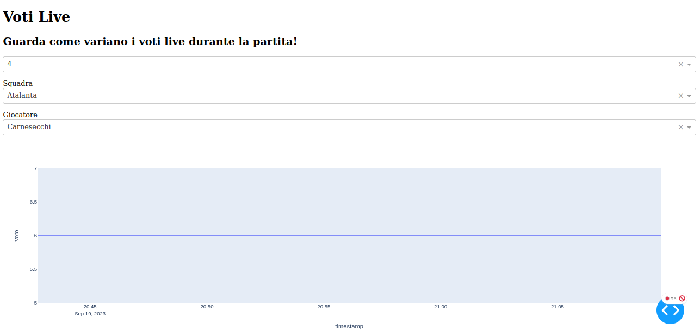

# fantacalcio-voti-live
**fantacalcio-voti-live** is a web dashboard that plots footballer votes over the time.
Usually the votes change when events, like penalties, goals, etc, happens during the match.

The dashboard is developed using Python Dash and data are stored in a postgresql database
that you can run on docker.

**Note:** Since season 2023-2024, **nodejs** and **protobufjs** are required!

Screenshot of the dashboard:


## Requirements
Python:
```
python3 -m venv venv
source venv/bin/activate
pip install -r requirements.txt
```

NodeJS:
```
npm install protobufjs
```

## Getting started

Run the Postgresql database in a docker container:
```
sudo docker run --rm -d --name fantacalcio_db -v $(pwd)/var/fantacalcio_pgdata:/var/lib/postgresql/data -e POSTGRES_USER=fantallenatore -e POSTGRES_PASSWORD=password -e POSTGRES_DB=fantacalcio_db -p 5432:5432 postgres
```

Run the scraper on the football teams that are currently playing and that you want to track:
- `--giornata` to specify the current match day
- `--until` to specify when to stop the scraper
```
python3 scraper.py "Empoli" "Cagliari" "Udinese" "Verona" "Genoa" "Salernitana" --giornata 25 --until "17:00"
```

Run the dashboard:
```
python3 dashboard.py
```

Access the dashboard locally at http://127.0.0.1:8050/

## Debug the db
Open a bash in the postgresql container:
```
sudo docker exec -it fantacalcio_db bash
```

Log into the db:
```
root@e7c9e144080e:/# psql -U fantallenatore -d fantacalcio_db
```

Show the tables:
```
fantacalcio_db=# select * from giocatore;
fantacalcio_db=# select * from voto;
```

## Run the scraper with crontab

To run the scraper automatically, you can edit crontab with a line similar to the following:
```
25 18 * * * /path/to/your/fantacalcio-voti-live/scraper.sh > ~/fantacalcio.log
```

## ToDo
- [x] insert in db only if any field is different from last inserted one.
  Probably you need to store a dictionary (key: player id, value: voto + eventi)
- [x] deploy on heroku
- [ ] docker-compose
- [ ] show match events on the plot

## Take Home
- Docker volumes to store db
- plotly and dash to make dashboards
  - callback chains for dropdowns
  - live updates of plots
- PostgreSQL and pgadmin
  - handling strings with quotes
  - timestamp type
  - `ON CONFLICT DO NOTHING` for insertion
  - `SELECT DISTINCT ON` for query unique values
- Python
  - implement `__eq__` for comparing objects
